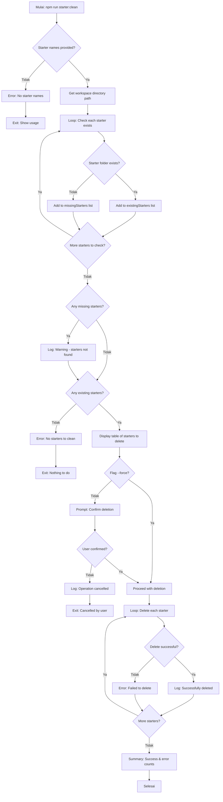

# Command: `starter:clean` / `starter:reset`

## Deskripsi

Command ini digunakan untuk **menghapus** proyek starter yang sudah dibuat di workspace. Command ini adalah operasi **BERBAHAYA** karena menghapus data tanpa bisa di-recover.

**Alias**: Command ini memiliki alias `starter:reset` yang melakukan operasi yang sama.

## Cara Penggunaan

### Melalui npm script:

```bash
npm run starter:clean <starterName...>
# atau
npm run starter:reset <starterName...>
```

### Melalui CLI langsung:

```bash
ts-node scripts/cli.ts starter:clean [starterNames...] [options]
# atau
ts-node scripts/cli.ts starter:reset [starterNames...] [options]
```

## Parameter / Options

| Parameter           | Alias | Tipe     | Default    | Deskripsi                                                                 |
| ------------------- | ----- | -------- | ---------- | ------------------------------------------------------------------------- |
| `[starterNames...]` | -     | string[] | _required_ | Nama workspace/starter(s) yang akan dihapus                               |
| `--force`           | -     | boolean  | `false`    | Skip konfirmasi dan langsung hapus (DANGEROUS)                            |
| `--cwd <path>`      | -     | string   | -          | Menjalankan command seolah-olah dieksekusi dari direktori yang ditentukan |
| `--verbose`         | -     | boolean  | `false`    | Menampilkan log yang lebih detail                                         |
| `--json`            | -     | boolean  | `false`    | Mode output JSON (untuk CI/parsing log)                                   |

## Prasyarat

### Software yang Diperlukan:

1. **Node.js & npm** - Untuk menjalankan script
2. **ts-node** - Untuk eksekusi TypeScript

### Kondisi Awal:

- Workspace/starter sudah dibuat sebelumnya di folder `./workspace`
- **PERHATIAN**: Semua data di workspace akan hilang!

## Alur Eksekusi (Flow)



### Detail Proses:

1. **Validasi Input**

   - Cek apakah ada starter names yang provided
   - Jika tidak: error dengan usage hint
   - Workspace directory: dari `resolveWorkspaceDir()` helper

2. **Check Starter Existence**

   - Loop setiap starter name yang diberikan
   - Cek apakah folder `workspace/<starter-name>` exists
   - Pisahkan menjadi 2 list:
     - `existingStarters`: yang ada dan akan dihapus
     - `missingStarters`: yang tidak ditemukan (warning only)

3. **Report Missing Starters**

   - Jika ada missing starters: tampilkan warning
   - List starters yang tidak ditemukan
   - Ini tidak menghentikan proses (non-fatal)

4. **Validate Existing Starters**

   - Jika tidak ada existing starters: error dan exit
   - Display table berisi list starters yang akan dihapus

5. **Konfirmasi User** (jika tidak ada flag `--force`)

   - Prompt:
     ```
     ? Are you sure you want to delete the above starter(s)?
       This action cannot be undone. (y/N)
     ```
   - Default: **No** (untuk keamanan)
   - Jika user pilih "No": batalkan operasi dan exit

6. **Bypass Konfirmasi** (dengan flag `--force`)

   - Langsung proses penghapusan tanpa konfirmasi
   - **WARNING**: Sangat berbahaya!
   - Cocok untuk automation/CI/CD

7. **Penghapusan Starters**

   - Loop setiap existing starter
   - Gunakan `fs.rmSync()` dengan options:
     - `recursive: true` - hapus semua isi folder
     - `force: true` - tidak error jika tidak ada
   - Track success dan error count
   - Log per starter: success atau error

8. **Summary**
   - Display total successfully cleaned
   - Display total failed (jika ada)
   - Exit

## Konfigurasi

Workspace directory diambil dari helper:

```typescript
const workspaceDir = resolveWorkspaceDir();
// Returns: "./workspace" (relative to project root)
```

Path yang akan dihapus:

```typescript
const starterPath = path.join(workspaceDir, starterName);
// Example: "./workspace/fhe-counter"
```

## Contoh Penggunaan

### 1. Clean Single Starter (Recommended)

```bash
npm run starter:clean fhe-counter
```

Output:

```
ℹ Workspace directory: ./workspace
ℹ Starters to clean: fhe-counter

The following starters will be removed from workspace:
┌─────────────────┐
│ Starter         │
├─────────────────┤
│ fhe-counter     │
└─────────────────┘

? Are you sure you want to delete the above starter(s)?
  This action cannot be undone. (y/N) › Yes

ℹ Deleting fhe-counter...
✓ Successfully deleted fhe-counter
✓ Successfully cleaned: 1 starter(s)
```

### 2. Clean Multiple Starters

```bash
npm run starter:clean fhe-counter simple-voting erc20-token
```

Output:

```
ℹ Workspace directory: ./workspace
ℹ Starters to clean: fhe-counter, simple-voting, erc20-token

The following starters will be removed from workspace:
┌─────────────────┐
│ Starter         │
├─────────────────┤
│ fhe-counter     │
│ simple-voting   │
│ erc20-token     │
└─────────────────┘

? Are you sure you want to delete the above starter(s)?
  This action cannot be undone. (y/N) ›
```

### 3. Clean dengan Force (Skip Confirmation)

```bash
npm run starter:clean fhe-counter --force
```

Output:

```
ℹ Workspace directory: ./workspace
ℹ Starters to clean: fhe-counter

The following starters will be removed from workspace:
┌─────────────────┐
│ Starter         │
├─────────────────┤
│ fhe-counter     │
└─────────────────┘

ℹ Deleting fhe-counter...
✓ Successfully deleted fhe-counter
✓ Successfully cleaned: 1 starter(s)
```

### 4. Clean Non-Existent Starter

```bash
npm run starter:clean non-existent-starter
```

Output:

```
ℹ Workspace directory: ./workspace
ℹ Starters to clean: non-existent-starter

⚠ The following starters do not exist in workspace:
⚠   - non-existent-starter

✗ No starters found in workspace to clean.
```

### 5. Clean Mixed (Existing + Non-Existent)

```bash
npm run starter:clean fhe-counter non-existent simple-voting
```

Output:

```
ℹ Workspace directory: ./workspace
ℹ Starters to clean: fhe-counter, non-existent, simple-voting

⚠ The following starters do not exist in workspace:
⚠   - non-existent

The following starters will be removed from workspace:
┌─────────────────┐
│ Starter         │
├─────────────────┤
│ fhe-counter     │
│ simple-voting   │
└─────────────────┘

? Are you sure you want to delete the above starter(s)?
  This action cannot be undone. (y/N) ›
```

### 6. Clean dengan Alias

```bash
npm run starter:reset fhe-counter --force
```

Sama seperti `starter:clean`.

### 7. Cancel Operation

```bash
npm run starter:clean fhe-counter
```

```
? Are you sure you want to delete the above starter(s)?
  This action cannot be undone. (y/N) › No

ℹ Operation cancelled.
```

### 8. Clean All Workspaces (Manual)

```bash
# List semua workspace
ls workspace/

# Clean satu per satu
npm run starter:clean workspace1 workspace2 workspace3 --force

# Atau manual (lebih cepat tapi berbahaya!)
rm -rf workspace/*
```

## Use Cases

### 1. Cleanup After Testing

```bash
# Create test workspace
npm run starter:create fhe-counter --dir test-counter

# Test...
cd workspace/test-counter
npm install
npm test

# Cleanup
cd ../..
npm run starter:clean test-counter --force
```

### 2. Remove Failed/Corrupted Workspace

```bash
# Workspace creation failed or corrupt
npm run starter:clean failed-workspace --force
npm run starter:create fhe-counter --dir failed-workspace
```

### 3. Fresh Start

```bash
# Delete and recreate
npm run starter:clean my-project
npm run starter:create fhe-counter --dir my-project
```

### 4. Batch Cleanup

```bash
# Clean multiple old test workspaces
npm run starter:clean test-1 test-2 test-3 test-4 --force
```

### 5. Selective Cleanup

```bash
# Keep some, delete others
ls workspace/
# my-project-v1 my-project-v2 my-project-v3

npm run starter:clean my-project-v1 my-project-v2 --force
# Keep: my-project-v3 (latest)
```

## Error Handling

### Error: "No starter names provided"

**Penyebab**: Command dijalankan tanpa argument

**Example**:

```bash
npm run starter:clean
# ❌ Error!
```

**Solusi**: Provide starter name(s):

```bash
npm run starter:clean fhe-counter
```

**Usage Hint**:

```
ℹ Usage: npm run starter:clean <starterName...>
```

### Error: "No starters found in workspace to clean"

**Penyebab**: Semua starter names yang diberikan tidak ada di workspace

**Solusi**:

1. List workspace contents:
   ```bash
   ls workspace/
   ```
2. Clean dengan nama yang benar:
   ```bash
   npm run starter:clean <correct-name>
   ```

### Warning: "The following starters do not exist in workspace"

**Penyebab**: Beberapa (tapi tidak semua) starter names tidak ada

**Impact**:

- Warning displayed
- Process continues untuk existing starters
- Non-fatal (tidak stop proses)

**Solusi**: Tidak perlu action. Yang ada tetap akan dihapus.

### Error: "Failed to delete <starter>"

**Penyebab**:

- Permission denied
- File/folder being used by another process
- File system error

**Solusi**:

1. Close semua aplikasi yang menggunakan file di workspace
2. Check permissions
3. Try manual delete:
   ```bash
   rm -rf workspace/<starter-name>
   ```
4. On Windows, restart terminal atau restart komputer

### Info: "Operation cancelled"

**Penyebab**: User memilih "No" pada konfirmasi

**Solusi**: Ini adalah behavior yang diharapkan. Tidak ada yang berubah.

## Safety Features

### 1. Konfirmasi Default

- Tanpa flag `--force`, user harus konfirmasi
- Default answer: **No** (lebih aman)
- Prompt jelas: "cannot be undone"

### 2. Display Before Delete

- Table menampilkan semua starters yang akan dihapus
- User bisa review sebelum confirm

### 3. Separate Existing/Missing

- Report missing starters (tapi tidak stop proses)
- Hanya existing starters yang bisa dihapus

### 4. Error Tracking

- Track success dan error count per starter
- Summary di akhir untuk review

### 5. Explicit Names Required

- Tidak ada "delete all" command
- User harus explicitly name starters to delete

## Best Practices

### 1. Backup Sebelum Clean

```bash
# Backup jika ada perubahan penting
cp -r workspace/my-project workspace/my-project-backup
npm run starter:clean my-project
```

### 2. Gunakan Git untuk Tracking

```bash
# Commit sebelum clean
cd workspace/my-project
git add .
git commit -m "backup before cleanup"
git push

# Lalu clean
cd ../..
npm run starter:clean my-project
```

### 3. Avoid --force di Development

```bash
# Development: gunakan konfirmasi (safer)
npm run starter:clean my-project

# CI/CD: boleh gunakan --force (faster)
npm run starter:clean test-workspace --force
```

### 4. Check Before Clean

```bash
# List workspace contents
ls -la workspace/

# Verify you're deleting the right ones
npm run starter:clean old-project-1 old-project-2
```

### 5. Clean Test Workspaces Regularly

```bash
# Clean up test workspaces after testing
npm run starter:clean test-* --force
# Note: shell glob expansion might not work, list explicitly:
npm run starter:clean test-1 test-2 test-3 --force
```

## Perbedaan dengan Command Lain

### vs `template:reset`

| Command          | Target                 | Scope           | Purpose                       |
| ---------------- | ---------------------- | --------------- | ----------------------------- |
| `template:reset` | `./base` templates     | Base templates  | Clean templates untuk re-init |
| `starter:clean`  | `./workspace` projects | User workspaces | Clean user projects           |

```bash
# template:reset: clean templates
npm run template:reset

# starter:clean: clean workspaces
npm run starter:clean my-project
```

### vs Manual Delete

| Method          | Safety                      | Speed     | Flexibility                      |
| --------------- | --------------------------- | --------- | -------------------------------- |
| `starter:clean` | ✅ Confirmation, validation | 🐢 Slower | Limited to workspace folder      |
| Manual `rm -rf` | ⚠️ No confirmation          | 🚀 Faster | Can delete anything (dangerous!) |

```bash
# Safer (recommended)
npm run starter:clean my-project

# Faster (use with caution!)
rm -rf workspace/my-project
```

## Kombinasi dengan Command Lain

### Clean & Recreate

```bash
npm run starter:clean my-project
npm run starter:create fhe-counter --dir my-project
```

### Multiple Clean Operations

```bash
# Clean old versions
npm run starter:clean v1 v2 v3 --force

# Create new version
npm run starter:create fhe-counter --dir v4
```

### Cleanup Script

Add to `package.json`:

```json
{
  "scripts": {
    "clean:tests": "npm run starter:clean test-workspace --force",
    "clean:old": "npm run starter:clean old-project-1 old-project-2 --force",
    "reset:workspace": "npm run starter:clean my-workspace && npm run starter:create fhe-counter --dir my-workspace"
  }
}
```

Usage:

```bash
npm run clean:tests
npm run clean:old
npm run reset:workspace
```

## Automation Example

### Batch Cleanup Script

```bash
#!/bin/bash
# cleanup-old-workspaces.sh

WORKSPACES=("test-1" "test-2" "test-3" "old-project")

for ws in "${WORKSPACES[@]}"; do
  npm run starter:clean "$ws" --force
done

echo "✅ Cleanup completed"
```

### CI/CD Cleanup

```yaml
# .github/workflows/cleanup.yml
name: Cleanup Test Workspaces

on:
  workflow_run:
    workflows: ["Test Starters"]
    types:
      - completed

jobs:
  cleanup:
    runs-on: ubuntu-latest
    steps:
      - uses: actions/checkout@v2

      - name: Setup Node.js
        uses: actions/setup-node@v2

      - name: Install dependencies
        run: npm install

      - name: Clean test workspaces
        run: |
          npm run starter:clean test-fhe-counter --force
          npm run starter:clean test-voting --force
          npm run starter:clean test-erc20 --force
```

## File yang Terkait

- **Script**: `scripts/commands/starterClean.ts`
- **CLI**: `scripts/cli.ts`
- **Helper**:
  - `lib/helper/path-utils.ts` (resolveWorkspaceDir)
  - `lib/helper/logger.ts` (output formatting)

## Recovery Options

### Jika Tidak Sengaja Delete:

**Tidak ada undo untuk command ini!**

Recovery options:

1. **Git Recovery** (jika workspace di-commit):

   ```bash
   git checkout workspace/my-project
   ```

2. **Backup Recovery** (jika ada backup):

   ```bash
   cp -r workspace/my-project-backup workspace/my-project
   ```

3. **Recreate** (dari starter template):

   ```bash
   npm run starter:create fhe-counter --dir my-project
   # Note: custom changes will be lost
   ```

4. **No Recovery** (jika tidak ada backup/commit):
   - Data hilang permanen
   - Harus recreate dan re-implement custom changes

## Workspace Structure

Struktur yang akan dihapus:

```
workspace/
└── <starter-name>/           ← This entire folder will be DELETED
    ├── contracts/
    ├── test/
    ├── deploy/
    ├── tasks/
    ├── ui/
    ├── node_modules/         ← All dependencies deleted
    ├── hardhat.config.ts
    ├── package.json
    ├── .env                  ← Environment configs deleted
    └── README.md
```

## Notes

- Command ini adalah **DESTRUCTIVE** operation
- Tidak ada "undo" atau "recycle bin"
- Gunakan dengan **sangat hati-hati**
- Hanya workspace di `./workspace` yang bisa dihapus (tidak bisa delete folder lain)
- Alias `starter:reset` melakukan hal yang persis sama
- Validation: hanya delete folder yang benar-benar ada
- Missing starters: warning only (non-fatal)
- Success/error tracking per starter
- Cocok untuk cleanup test workspaces dan prototypes
- **Tidak mempengaruhi** `./starters` (template source) atau `./base` (base templates)
