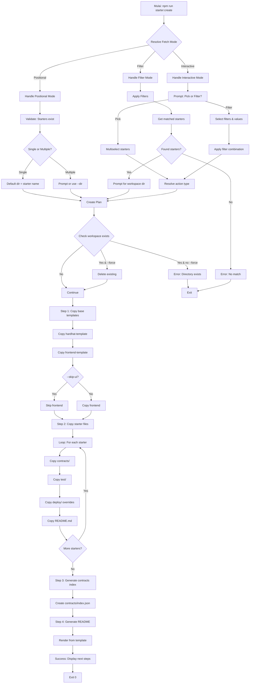

# Command: `starter:create`

## Deskripsi

Command ini digunakan untuk **membuat proyek baru** dengan menyalin folder template dari `/starters` dan `/base`. Command ini adalah operasi utama untuk men-generate workspace siap-pakai yang berisi smart contracts FHE, tests, dan frontend.

Command ini mendukung **3 mode pemilihan starter**:

1. **Positional**: Pilih starter via argumen posisi
2. **Filter**: Pilih starter via filter metadata (category, chapter, tags, concepts)
3. **Interactive**: Guided prompt untuk memilih starter

## Cara Penggunaan

### Melalui npm script:

```bash
# Positional mode: pilih starter by name
npm run starter:create <starterName> [<starterName2>...] [options]

# Filter mode: pilih starter by taxonomy
npm run starter:create -- --category <category> [options]

# Interactive mode: prompt interaktif
npm run starter:create
```

### Melalui CLI langsung:

```bash
ts-node scripts/cli.ts starter:create [starterNames...] [options]
```

## Parameter / Options

| Parameter                  | Alias | Tipe     | Default | Deskripsi                                                            |
| -------------------------- | ----- | -------- | ------- | -------------------------------------------------------------------- |
| `[starterNames...]`        | -     | string[] | -       | Nama starter(s) yang akan dibuat (positional mode)                   |
| `-d, --dir <dir>`          | -     | string   | -       | Target directory untuk workspace (dalam ./workspace)                 |
| `--category <category>`    | -     | string   | -       | Filter: pilih starter by category (filter mode)                      |
| `--chapter <chapter>`      | -     | string   | -       | Filter: pilih starter by chapter (filter mode)                       |
| `--tags <tags...>`         | -     | string[] | -       | Filter: pilih starter by tags (filter mode)                          |
| `--concepts <concepts...>` | -     | string[] | -       | Filter: pilih starter by concepts (filter mode)                      |
| `--and`                    | -     | boolean  | `false` | Operator AND untuk multiple tags/concepts (default: OR)              |
| `--skip-ui`                | -     | boolean  | `false` | Skip copying frontend files                                          |
| `--force`                  | -     | boolean  | `false` | Overwrite existing files di target directory                         |
| `--cwd <path>`             | -     | string   | -       | Menjalankan command seolah dieksekusi dari direktori yang ditentukan |
| `--verbose`                | -     | boolean  | `false` | Menampilkan log yang lebih detail                                    |
| `--json`                   | -     | boolean  | `false` | Mode output JSON (untuk CI/parsing log)                              |

## Prasyarat

### Software yang Diperlukan:

1. **Node.js & npm** - Untuk menjalankan script
2. **ts-node** - Untuk eksekusi TypeScript
3. **Git** - Untuk template yang sudah di-clone

### Kondisi Awal:

- **Template sudah di-init** di `./base`:
  ```bash
  npm run template:init
  ```
- **Frontend sudah di-build** (jika tidak skip UI):
  ```bash
  npm run template:build-ui
  ```
- Folder `./starters` ada dan berisi starter projects

### Quick Setup:

```bash
# All-in-one setup
npm run start
# Ini menjalankan: template:init + template:build-ui
```

## Mode Pemilihan Starter

### 1. Positional Mode

Pilih starter dengan menyebutkan nama langsung di command line.

```bash
# Single starter
npm run starter:create fhe-counter

# Multiple starters
npm run starter:create fhe-counter simple-voting erc20-token
```

**Behavior**:

- Starter names sebagai positional arguments
- Validasi: semua starter harus ada
- Tidak bisa dikombinasi dengan filter options

### 2. Filter Mode

Pilih starter dengan filtering berdasarkan metadata.

```bash
# Filter by category
npm run starter:create -- --category fundamental

# Filter by chapter
npm run starter:create -- --chapter basic

# Filter by tags (OR logic)
npm run starter:create -- --tags defi token

# Multiple filters (AND logic antar tipe)
npm run starter:create -- --category patterns --tags voting --chapter intermediate

# AND logic untuk tags
npm run starter:create -- --tags defi token --and
```

**Behavior**:

- Tidak ada positional arguments
- Minimal 1 filter harus provided
- Multiple values dalam 1 filter: OR logic (default)
- Multiple filters berbeda: AND logic
- Flag `--and`: mengubah OR menjadi AND untuk combine hasil antar filter
- Tidak bisa dikombinasi dengan positional mode

### 3. Interactive Mode

Guided prompt jika tidak ada input yang cukup.

```bash
# No arguments → interactive
npm run starter:create
```

**Behavior**:

- Prompt user untuk memilih metode: "Pick by name" atau "Filter by taxonomy"
- **Pick by name**: Multiselect dari daftar starter
- **Filter by taxonomy**:
  - Pilih fields (category, chapter, tags, concepts)
  - Pilih values untuk each field
  - Pilih operator combine: OR atau AND
- Prompt untuk nama workspace directory

## Alur Eksekusi (Flow)

### High-Level Flow



### Detailed Flow

#### Step 1: Copy Base Templates

```
workspace/
└── <workspace-name>/
    ├── contracts/           ← from ./base/hardhat-template/contracts
    ├── deploy/              ← from ./base/hardhat-template/deploy
    ├── test/                ← from ./base/hardhat-template/test
    ├── tasks/               ← from ./base/hardhat-template/tasks
    ├── hardhat.config.ts    ← from ./base/overrides/hardhat.config.ts
    ├── package.json         ← from ./base/overrides/package.json
    ├── tsconfig.json        ← from ./base/hardhat-template/tsconfig.json
    ├── .gitignore           ← from ./base/hardhat-template/.gitignore
    └── ui/                  ← from ./base/frontend-template (if not --skip-ui)
        ├── src/
        ├── public/
        ├── package.json
        └── ...
```

#### Step 2: Copy Starter Files

```
For each starter:
  workspace/<workspace-name>/
  ├── contracts/
  │   └── <StarterContracts>.sol    ← from ./starters/<starter>/contracts
  ├── test/
  │   └── <StarterTests>.ts          ← from ./starters/<starter>/test
  ├── deploy/
  │   └── deploy.ts (merged)         ← from ./starters/<starter>/deploy
  └── README-<starter>.md            ← from ./starters/<starter>/README.md
```

#### Step 3: Generate Contracts Index

```json
// workspace/<workspace-name>/ui/public/contracts/index.json
["fhe-counter", "simple-voting"]
```

#### Step 4: Generate README

- Use template: `./base/markdown-template/README.md.hbs`
- Inject: starter names, descriptions, metadata
- Output: `workspace/<workspace-name>/README.md`

## Contoh Penggunaan

### 1. Create Single Starter (Simple)

```bash
npm run starter:create fhe-counter
```

**Output**:

```
ℹ Creating starter(s) in workspace/fhe-counter using mode: positional
ℹ Starters to create: fhe-counter

━━━ Step 1: Copying base templates... ━━━━━━━━━━━━
✓ Base templates copied.

━━━ Step 2: Copying 1 starter(s)... ━━━━━━━━━━━━━━
✓ Starters copied.

━━━ Step 3: Generating contracts index... ━━━━━━━━
✓ Contracts index generated at workspace/fhe-counter/ui/public/contracts/index.json

━━━ Step 4: Modifying README.md... ━━━━━━━━━━━━━━━
✓ README.md generated.

━━━ All done! ━━━━━━━━━━━━━━━━━━━━━━━━━━━━━━━━━━━
📦 Next Steps
────────────────────────────────────
Navigate      cd "workspace/fhe-counter"
Install       npm install
Start         Start developing your FHE smart contracts!
```

### 2. Create Single Starter with Custom Directory

```bash
npm run starter:create fhe-counter --dir my-first-project
```

Workspace akan dibuat di: `workspace/my-first-project`

### 3. Create Multiple Starters

```bash
npm run starter:create fhe-counter simple-voting erc20-token --dir my-workspace
```

Semua 3 starters akan di-merge dalam 1 workspace: `workspace/my-workspace`

### 4. Create dengan Filter (Category)

```bash
npm run starter:create -- --category fundamental --dir fundamentals
```

Semua starters dengan category "fundamental" akan dibuat.

### 5. Create dengan Filter (Tags, OR logic)

```bash
npm run starter:create -- --tags defi token --dir defi-starters
```

Starters yang punya tag "defi" ATAU "token".

### 6. Create dengan Filter (Tags, AND logic)

```bash
npm run starter:create -- --tags defi token --and --dir defi-token-starters
```

Starters yang punya tag "defi" DAN "token".

### 7. Create dengan Multiple Filters

```bash
npm run starter:create -- --category patterns --chapter intermediate --tags voting --dir voting-patterns
```

Starters yang match semua kondisi:

- category = "patterns"
- chapter = "intermediate"
- tags include "voting"

### 8. Interactive Mode: Pick by Name

```bash
npm run starter:create
```

```
? How do you want to select starter(s)?
  ❯ Pick by starter name
    Filter by taxonomy

? Select starter(s) to create (Press <space> to select):
  ◉ FHE Counter (fhe-counter)
  ◯ Simple Voting (simple-voting)
  ◉ ERC20 Token (erc20-token)
  ◯ ERC721 NFT (erc721-nft)

? Enter the workspace directory:
  ❯ my-first-starters
```

### 9. Interactive Mode: Filter by Taxonomy

```bash
npm run starter:create
```

```
? How do you want to select starter(s)?
    Pick by starter name
  ❯ Filter by taxonomy

? Which filters do you want to apply? (Select at least one)
  ◉ Category
  ◉ Tags
  ◯ Chapter
  ◯ Concepts

? Combine selected filter fields using:
  ❯ OR (union)
    AND (intersection)

? Select category:
  ❯ fundamental
    patterns
    tokens

? Select tag(s):
  ◉ counter
  ◉ basic
  ◯ voting

Found 2 starter(s) matching filters.
Starters: fhe-counter, fhe-add

? Enter the workspace directory:
  ❯ my-workspace
```

### 10. Skip Frontend

```bash
npm run starter:create fhe-counter --skip-ui
```

Hanya copy contracts & tests, tanpa frontend.

### 11. Force Overwrite

```bash
npm run starter:create fhe-counter --dir my-project --force
```

Jika `workspace/my-project` sudah ada, akan dihapus dan dibuat ulang.

## Struktur Workspace yang Dihasilkan

### Single Starter

```
workspace/
└── fhe-counter/
    ├── contracts/
    │   ├── FHECounter.sol           ← from starter
    │   └── [base contracts]         ← from base template
    ├── test/
    │   ├── FHECounter.ts            ← from starter
    │   └── [base tests]             ← from base template
    ├── deploy/
    │   └── deploy.ts                ← merged
    ├── tasks/
    │   ├── accounts.ts              ← from base
    │   └── FHECounter.ts            ← from starter
    ├── ui/
    │   ├── src/
    │   ├── public/
    │   │   └── contracts/
    │   │       └── index.json       ← ["fhe-counter"]
    │   ├── package.json
    │   └── ...
    ├── hardhat.config.ts
    ├── package.json
    ├── tsconfig.json
    ├── .gitignore
    └── README.md                    ← generated
```

### Multiple Starters

```
workspace/
└── my-workspace/
    ├── contracts/
    │   ├── FHECounter.sol           ← from fhe-counter
    │   ├── SimpleVoting.sol         ← from simple-voting
    │   ├── ERC20Token.sol           ← from erc20-token
    │   └── [base contracts]
    ├── test/
    │   ├── FHECounter.ts
    │   ├── SimpleVoting.ts
    │   ├── ERC20Token.ts
    │   └── [base tests]
    ├── ui/
    │   └── public/
    │       └── contracts/
    │           └── index.json       ← ["fhe-counter", "simple-voting", "erc20-token"]
    ├── README.md                    ← lists all starters
    └── ...
```

## Error Handling

### Error: "The following starter(s) do not exist: ..."

**Penyebab**: Starter name yang disebutkan tidak ada di `./starters`

**Solusi**:

```bash
# Check available starters
npm run starter:list

# Create dengan nama yang benar
npm run starter:create <correct-name>
```

### Error: "Cannot use positional starter names with filter options"

**Penyebab**: Mencoba menggunakan positional mode DAN filter mode bersamaan

**Example Error**:

```bash
npm run starter:create fhe-counter --category fundamental
# ❌ Error!
```

**Solusi**: Pilih salah satu mode:

```bash
# Option A: Positional only
npm run starter:create fhe-counter

# Option B: Filter only
npm run starter:create -- --category fundamental
```

### Error: "No starters found matching the provided filters"

**Penyebab**: Tidak ada starter yang match dengan filter

**Solusi**:

1. Cek available values:
   ```bash
   npm run starter:list -- --mode json | jq '.starters[].category' | sort | uniq
   ```
2. Relax filters (kurangi jumlah filter)
3. Gunakan OR logic instead of AND

### Error: "Template frontend tidak ditemukan"

**Penyebab**: Template belum di-init atau belum di-build

**Solusi**:

```bash
npm run template:init
npm run template:build-ui

# Lalu create starter
npm run starter:create fhe-counter
```

### Error: "Destination directory already exists. Use --force to overwrite."

**Penyebab**: Workspace directory sudah ada

**Solusi**:

```bash
# Option A: Use different directory
npm run starter:create fhe-counter --dir fhe-counter-v2

# Option B: Force overwrite (DESTRUCTIVE!)
npm run starter:create fhe-counter --force

# Option C: Delete manually
rm -rf workspace/fhe-counter
npm run starter:create fhe-counter
```

### Error: "No starter names provided for positional mode"

**Penyebab**: Bug internal atau empty array

**Solusi**: Pastikan menyediakan starter name:

```bash
npm run starter:create fhe-counter
```

## Kombinasi dengan Command Lain

### Full Workflow dari Scratch

```bash
# 1. Setup templates
npm run start  # atau: template:init + template:build-ui

# 2. Explore starters
npm run starter:list

# 3. Create workspace
npm run starter:create fhe-counter --dir my-project

# 4. Setup workspace
cd workspace/my-project
npm install

# 5. Deploy contracts
npm run deploy

# 6. Run frontend
cd ui
npm run dev
```

### Create Multiple Projects

```bash
# Project 1: Basic starters
npm run starter:create fhe-counter fhe-add --dir basic-examples

# Project 2: DeFi starters
npm run starter:create erc20-token erc721-nft --dir token-examples

# Project 3: Advanced patterns
npm run starter:create simple-voting timelock-vesting --dir advanced-examples
```

### Rapid Prototyping

```bash
# Quick test a starter
npm run starter:create fhe-counter --dir test-counter
cd workspace/test-counter
npm install
npm test

# Clean up
cd ../..
npm run starter:clean test-counter --force
```

## Best Practices

### 1. Always Setup Templates First

```bash
# ✅ Correct order
npm run start  # setup templates
npm run starter:create fhe-counter

# ❌ Wrong order (will error)
npm run starter:create fhe-counter  # ERROR: template not found
```

### 2. Use Descriptive Directory Names

```bash
# ❌ Generic
npm run starter:create fhe-counter --dir project1

# ✅ Descriptive
npm run starter:create fhe-counter --dir voting-dao-mvp
```

### 3. Group Related Starters

```bash
# Create workspace dengan multiple related starters
npm run starter:create erc20-token access-control-role --dir token-with-access-control
```

### 4. List Before Create

```bash
# Discovery workflow
npm run starter:list -- --tags defi
npm run starter:create erc20-token --dir my-defi-project
```

### 5. Use Version Control

```bash
npm run starter:create fhe-counter --dir my-project
cd workspace/my-project
git init
git add .
git commit -m "Initial commit: FHE Counter starter"
```

### 6. Skip UI for Backend-Only Projects

```bash
# Backend only (contracts + tests)
npm run starter:create fhe-counter --skip-ui --dir backend-only
```

### 7. Document Workspace Purpose

```bash
# README.md akan di-generate otomatis dengan info starters
# Tambahkan custom notes:
cd workspace/my-project
echo "## Custom Notes\n- Purpose: ...\n- Team: ..." >> README.md
```

## Advanced Usage

### Automation Script

Create helper script di `package.json`:

```json
{
  "scripts": {
    "new:basic": "npm run starter:create -- --chapter basic --dir basic-playground",
    "new:defi": "npm run starter:create -- --tags defi --dir defi-playground",
    "new:voting": "npm run starter:create simple-voting --dir voting-app"
  }
}
```

Usage:

```bash
npm run new:basic
npm run new:defi
npm run new:voting
```

### Batch Create

```bash
# Create multiple workspaces at once
for starter in fhe-counter simple-voting erc20-token; do
  npm run starter:create $starter --dir test-$starter
done
```

### CI/CD Integration

```yaml
# .github/workflows/test-starters.yml
name: Test All Starters

on: [push]

jobs:
  test:
    runs-on: ubuntu-latest
    strategy:
      matrix:
        starter: [fhe-counter, simple-voting, erc20-token]
    steps:
      - uses: actions/checkout@v2
      - name: Setup Node
        uses: actions/setup-node@v2
      - name: Setup templates
        run: npm run start
      - name: Create starter
        run: npm run starter:create ${{ matrix.starter }} --dir test-${{ matrix.starter }}
      - name: Install dependencies
        run: cd workspace/test-${{ matrix.starter }} && npm install
      - name: Run tests
        run: cd workspace/test-${{ matrix.starter }} && npm test
```

## File yang Terkait

- **Script**: `scripts/commands/starterCreate.ts`
- **CLI**: `scripts/cli.ts`
- **Helpers**:
  - `lib/helper/starters.ts` - Copy operations
  - `lib/helper/path-utils.ts` - Path resolution
  - `lib/helper/renderHbs.ts` - README generation
- **Config**: `starterkit.config.ts`
- **Templates**:
  - `./base/hardhat-template/`
  - `./base/frontend-template/`
  - `./base/markdown-template/README.md.hbs`
  - `./base/overrides/`

## Next Steps setelah Create

```bash
# 1. Navigate
cd workspace/my-project

# 2. Install dependencies
npm install

# 3. Configure environment (if needed)
cp .env.example .env
# Edit .env dengan values yang sesuai

# 4. Compile contracts
npm run compile

# 5. Run tests
npm test

# 6. Deploy to network
npm run deploy

# 7. Start frontend (if UI included)
cd ui
npm install
npm run dev
```

## Notes

- Command ini **creates new workspace** dari template
- **Tidak mengubah** file di `./starters` atau `./base`
- Multiple starters akan di-**merge** dalam 1 workspace
- Frontend UI akan di-setup untuk auto-detect contracts
- `contracts/index.json` di-generate untuk frontend integration
- README.md di-generate dari template dengan metadata starters
- Flag `--force` adalah **DESTRUCTIVE** - akan hapus existing workspace
- `--skip-ui` berguna untuk backend-only development
- Interactive mode paling user-friendly untuk exploration
- Filter mode powerful untuk batch create by taxonomy
- Positional mode paling simple untuk single/known starters
