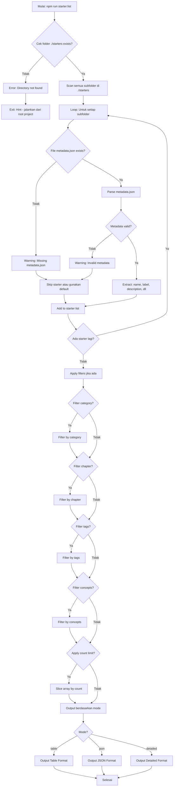

# Command: `starter:list`

## Deskripsi

Command ini digunakan untuk menampilkan daftar **proyek starter** yang tersedia di folder `./starters`. Command ini adalah **read-only** operation yang membantu developer melihat starter apa saja yang bisa digunakan untuk membuat proyek baru.

## Cara Penggunaan

### Melalui npm script:

```bash
npm run starter:list
```

### Melalui CLI langsung:

```bash
ts-node scripts/cli.ts starter:list [options]
```

## Parameter / Options

| Parameter               | Alias | Tipe    | Default   | Deskripsi                                                                 |
| ----------------------- | ----- | ------- | --------- | ------------------------------------------------------------------------- |
| `--mode <mode>`         | -     | string  | `"table"` | Format output: `table`, `json`, `detailed`                                |
| `--category <category>` | -     | string  | -         | Filter berdasarkan kategori (e.g., "fundamental", "patterns")             |
| `--chapter <chapter>`   | -     | string  | -         | Filter berdasarkan chapter (e.g., "basic", "intermediate")                |
| `--tags <tags>`         | -     | string  | -         | Filter berdasarkan tags, pisah dengan koma (e.g., "defi,nft")             |
| `--concepts <concepts>` | -     | string  | -         | Filter berdasarkan konsep (e.g., "fhe-operations,fhe-encryption")         |
| `--count <number>`      | -     | number  | -         | Batasi jumlah starter yang ditampilkan                                    |
| `--cwd <path>`          | -     | string  | -         | Menjalankan command seolah-olah dieksekusi dari direktori yang ditentukan |
| `--verbose`             | -     | boolean | `false`   | Menampilkan log yang lebih detail                                         |
| `--json`                | -     | boolean | `false`   | Shortcut untuk `--mode json`                                              |

## Prasyarat

### Software yang Diperlukan:

1. **Node.js & npm** - Untuk menjalankan script
2. **ts-node** - Untuk eksekusi TypeScript

### Kondisi Awal:

- Folder `./starters` ada dan berisi starter projects
- Setiap starter sebaiknya memiliki file `metadata.json` untuk informasi lengkap

### Struktur Starter yang Diharapkan:

```
./starters/
├── fhe-counter/
│   ├── metadata.json    ← Informasi starter
│   ├── README.md
│   ├── contracts/
│   └── test/
├── simple-voting/
│   ├── metadata.json
│   └── ...
└── ...
```

## Alur Eksekusi (Flow)



### Detail Proses:

1. **Validasi Direktori Starters**

   - Cek apakah folder `./starters` ada
   - Path: dari `resolveStartersDir()` helper
   - Jika tidak ada: error dengan hint untuk run dari root project

2. **Scan Starter Projects**

   - Baca semua subfolder di `./starters`
   - Untuk setiap folder, coba baca `metadata.json`
   - Jika tidak ada metadata: warning (tapi tetap include jika bisa)

3. **Parse Metadata**

   - Baca file `metadata.json` dari setiap starter
   - Validasi struktur menggunakan Zod schema
   - Extract informasi:
     - `name`: Nama folder starter (identifier)
     - `label`: Nama tampilan (human-readable)
     - `description`: Deskripsi singkat
     - `category`: Kategori (e.g., "fundamental", "patterns")
     - `chapter`: Level kesulitan (e.g., "basic", "intermediate")
     - `tags`: Array tags (e.g., ["defi", "token"])
     - `concepts`: Array konsep FHE (e.g., ["fhe-operations"])
     - `version`: Versi starter

4. **Apply Filters** (opsional)

   - Filter by **category**: exact match
   - Filter by **chapter**: exact match
   - Filter by **tags**: comma-separated, OR logic
   - Filter by **concepts**: comma-separated, OR logic
   - Filters bisa dikombinasikan (AND logic antar filter type)

5. **Apply Count Limit** (opsional)

   - Jika `--count` specified: slice array
   - Tetap hitung total sebelum slice untuk metadata

6. **Output Result**

   - **Table Mode** (default): Tabel rapi dengan kolom utama
   - **JSON Mode**: Output JSON untuk parsing programmatic
   - **Detailed Mode**: Detail lengkap per starter dengan section

7. **Display Metadata**
   - Total starters found
   - Total showing (after filters & count)
   - Warning count (starters dengan metadata issues)

## Format Metadata (`metadata.json`)

Setiap starter sebaiknya memiliki file `metadata.json` dengan struktur:

```json
{
  "name": "fhe-counter",
  "label": "FHE Counter",
  "description": "A simple encrypted counter using FHE operations",
  "version": "1.0.0",
  "category": "fundamental",
  "chapter": "basic",
  "tags": ["counter", "basic", "starter"],
  "concepts": ["fhe-operations", "encrypted-state"],
  "author": "Zama Team",
  "difficulty": "beginner",
  "estimatedTime": "15min"
}
```

**Required fields**:

- `name`
- `label`
- `description`

**Optional fields**:

- `category`
- `chapter`
- `tags`
- `concepts`
- `version`
- `author`
- `difficulty`
- `estimatedTime`

## Contoh Penggunaan

### 1. List Semua Starter (Table Mode)

```bash
npm run starter:list
```

Output:

```
┌────────────────────────────────┬──────────────┬──────────────┬─────────────────────┬──────────────┐
│ Name                           │ Category     │ Chapter      │ Concepts            │ Tags         │
├────────────────────────────────┼──────────────┼──────────────┼─────────────────────┼──────────────┤
│ FHE Counter (fhe-counter)      │ fundamental  │ basic        │ fhe-operations      │ counter      │
│ Simple Voting (simple-voting)  │ patterns     │ intermediate │ fhe-comparison      │ voting,dao   │
│ ERC20 Token (erc20-token)      │ tokens       │ intermediate │ fhe-encryption      │ erc20,defi   │
└────────────────────────────────┴──────────────┴──────────────┴─────────────────────┴──────────────┘
```

### 2. List dengan Detail Lengkap

```bash
npm run starter:list -- --mode detailed
```

Output:

```
━━━ Starter Projects ━━━━━━━━━━━━━━━━━━━━━━━━━━━━
Path         : ./starters
Showing      : 8
Total        : 8
────────────────────────────────────────────────

──── FHE Counter ────────────────────────────────
Label        : FHE Counter
Name         : fhe-counter
Description  : A simple encrypted counter using FHE operations
Category     : fundamental
Tags         : counter, basic, starter
Chapter      : basic
Version      : 1.0.0

──── Simple Voting ──────────────────────────────
Label        : Simple Voting
Name         : simple-voting
Description  : Private voting system using FHE
Category     : patterns
Tags         : voting, dao, governance
Chapter      : intermediate
Version      : 1.0.0
...
```

### 3. List dengan JSON Output

```bash
npm run starter:list -- --mode json
```

Output:

```json
{
  "path": "./starters",
  "total": 8,
  "showing": 8,
  "warnings": 0,
  "starters": [
    {
      "name": "fhe-counter",
      "label": "FHE Counter",
      "description": "A simple encrypted counter using FHE operations",
      "version": "1.0.0",
      "category": "fundamental",
      "tags": ["counter", "basic"],
      "chapter": "basic",
      "concepts": ["fhe-operations"]
    },
    ...
  ]
}
```

### 4. Filter by Category

```bash
npm run starter:list -- --category fundamental
```

Hanya menampilkan starter dengan category "fundamental".

### 5. Filter by Tags

```bash
npm run starter:list -- --tags "defi,token"
```

Menampilkan starter yang memiliki tag "defi" ATAU "token".

### 6. Kombinasi Filters

```bash
npm run starter:list -- --category patterns --chapter intermediate --tags voting
```

Menampilkan starter yang:

- Category = "patterns" AND
- Chapter = "intermediate" AND
- Tags contains "voting"

### 7. Limit Result

```bash
npm run starter:list -- --count 3
```

Hanya tampilkan 3 starter pertama (tapi tetap hitung total).

### 8. JSON untuk Parsing

```bash
npm run starter:list -- --json | jq '.starters[].name'
```

Output:

```
"fhe-counter"
"simple-voting"
"erc20-token"
...
```

## Output Modes Detail

### 1. Table Mode (Default)

- Tampilan tabel rapi
- Kolom: Name, Category, Chapter, Concepts, Tags
- Mudah dibaca manusia
- Good for terminal viewing

### 2. Detailed Mode

- Section per starter
- Semua field ditampilkan
- Key-value format
- Separator antar starter
- Good for documentation

### 3. JSON Mode

- Machine-readable
- Include metadata: path, total, showing, warnings
- Array of starters with all fields
- Good for CI/CD, scripting, parsing

## Filter Logic

### Single Field Filter

```bash
--category fundamental
# Menampilkan starter dengan category === "fundamental"
```

### Multiple Values (OR logic)

```bash
--tags "defi,token,nft"
# Menampilkan starter yang punya tag: defi OR token OR nft
```

### Multiple Filters (AND logic)

```bash
--category fundamental --chapter basic
# Menampilkan starter dengan:
# category === "fundamental" AND chapter === "basic"
```

### Complex Filter

```bash
--category patterns --tags "voting,dao" --concepts "fhe-comparison"
# Menampilkan starter dengan:
# category === "patterns" AND
# (tags includes "voting" OR "dao") AND
# (concepts includes "fhe-comparison")
```

## Use Cases

### 1. Discover Available Starters

```bash
npm run starter:list
```

### 2. Find Starter for Learning

```bash
# Cari starter level basic
npm run starter:list -- --chapter basic
```

### 3. Find Starter by Use Case

```bash
# Cari starter terkait token
npm run starter:list -- --tags token

# Cari starter terkait DeFi
npm run starter:list -- --tags defi
```

### 4. Export to File

```bash
# Export JSON
npm run starter:list -- --json > starters.json

# Export table (plain text)
npm run starter:list > starters.txt
```

### 5. Programmatic Access

```bash
# Get starter names
npm run starter:list -- --json | jq -r '.starters[].name'

# Count starters
npm run starter:list -- --json | jq '.total'

# Filter in code
npm run starter:list -- --json | jq '.starters[] | select(.category=="fundamental")'
```

## Error Handling

### Error: "Directory not found"

**Penyebab**: Folder `./starters` tidak ditemukan

**Solusi**:

```bash
# Pastikan menjalankan command dari root project
cd /path/to/project-root
npm run starter:list

# Atau gunakan --cwd
npm run starter:list -- --cwd /path/to/project-root
```

### Warning: "Missing metadata.json"

**Penyebab**: Starter tidak punya file `metadata.json`

**Impact**:

- Starter tetap muncul di list
- Informasi terbatas (hanya nama folder)
- Warning count bertambah

**Solusi**: Tambahkan `metadata.json` ke starter tersebut.

### Warning: "Invalid metadata"

**Penyebab**: File `metadata.json` tidak valid (struktur/format salah)

**Solusi**:

1. Validasi JSON syntax:
   ```bash
   cat ./starters/my-starter/metadata.json | jq .
   ```
2. Cek struktur sesuai schema
3. Perbaiki dan test ulang

### No Results with Filters

**Penyebab**: Tidak ada starter yang match dengan filter

**Output**:

```
No starter projects found.
```

**Solusi**:

- Cek typo di filter value
- Coba filter lebih general
- List tanpa filter untuk lihat available values

## Best Practices

### 1. Always Include Metadata

Setiap starter sebaiknya punya `metadata.json`:

```bash
# Template metadata.json
cat > ./starters/my-starter/metadata.json << 'EOF'
{
  "name": "my-starter",
  "label": "My Awesome Starter",
  "description": "Description here",
  "category": "patterns",
  "chapter": "intermediate",
  "tags": ["tag1", "tag2"],
  "concepts": ["fhe-operations"],
  "version": "1.0.0"
}
EOF
```

### 2. Use Consistent Taxonomy

- **Categories**: fundamental, patterns, advanced, tokens, defi, nft
- **Chapters**: basic, intermediate, advanced
- **Tags**: lowercase, dash-separated
- **Concepts**: FHE-specific concepts

### 3. Check Before Creating Starter

```bash
# Lihat starter yang ada sebelum buat baru
npm run starter:list

# Cek apakah sudah ada yang mirip
npm run starter:list -- --tags "similar-topic"
```

### 4. Document in README

Update project README dengan output dari starter:list:

```bash
npm run starter:list -- --mode detailed > STARTERS.md
```

## Integration dengan Workflow

### Discovery Workflow

```bash
# 1. Lihat semua starter
npm run starter:list

# 2. Filter untuk use case
npm run starter:list -- --tags defi

# 3. Lihat detail spesifik
npm run starter:list -- --mode detailed | grep -A 10 "erc20-token"

# 4. Create starter
npm run starter:create erc20-token
```

### Validation Workflow

```bash
# Setelah tambah starter baru, validasi:
npm run starter:list -- --json | jq '.warnings'
# Output: 0 (no warnings)

# Cek starter baru muncul
npm run starter:list | grep "my-new-starter"
```

## File yang Terkait

- **Script**: `scripts/commands/starterList.ts`
- **CLI**: `scripts/cli.ts`
- **Helper**:
  - `lib/helper/starters.ts` (getAllStarterMetadata)
  - `lib/helper/path-utils.ts` (resolveStartersDir)
  - `lib/helper/logger.ts` (output formatting)
- **Schema**:
  - `lib/types/starterMetadata.schema.ts`

## Metadata Fields Reference

| Field           | Type     | Required | Description                     | Example                      |
| --------------- | -------- | -------- | ------------------------------- | ---------------------------- |
| `name`          | string   | ✅       | Unique identifier (folder name) | "fhe-counter"                |
| `label`         | string   | ✅       | Display name                    | "FHE Counter"                |
| `description`   | string   | ✅       | Short description               | "A simple encrypted counter" |
| `category`      | string   | ❌       | Category classification         | "fundamental"                |
| `chapter`       | string   | ❌       | Difficulty level                | "basic"                      |
| `tags`          | string[] | ❌       | Searchable tags                 | ["counter", "basic"]         |
| `concepts`      | string[] | ❌       | FHE concepts used               | ["fhe-operations"]           |
| `version`       | string   | ❌       | Starter version                 | "1.0.0"                      |
| `author`        | string   | ❌       | Author name                     | "Zama Team"                  |
| `difficulty`    | string   | ❌       | Difficulty indicator            | "beginner"                   |
| `estimatedTime` | string   | ❌       | Time to complete                | "15min"                      |

## Notes

- Command ini adalah **read-only** (tidak mengubah apapun)
- Tidak memerlukan template sudah di-init
- Bisa dijalankan kapan saja untuk discovery
- Output bisa di-pipe ke tools lain (jq, grep, dll)
- Metadata validation menggunakan Zod schema
- Missing metadata tidak block, hanya warning
- Filters case-sensitive
- Multiple values dalam 1 filter: OR logic
- Multiple filters berbeda: AND logic
