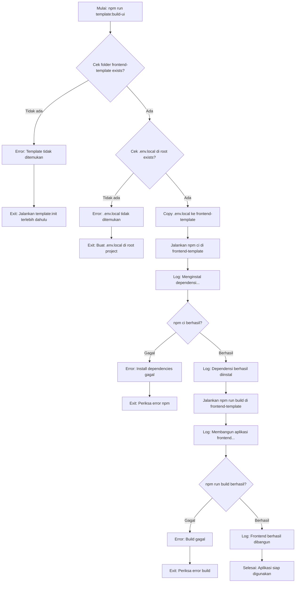

# Command: `template:build-ui`

## Deskripsi

Command ini digunakan untuk menyiapkan (setup) template Frontend yang sudah di-clone di folder `./base/frontend-template`. Script ini akan menginstall dependencies dan membuild aplikasi frontend sehingga siap digunakan dalam starter kit.

## Cara Penggunaan

### Melalui npm script:

```bash
npm run template:build-ui
```

### Melalui CLI langsung:

```bash
ts-node scripts/cli.ts template:build-ui
```

## Parameter / Options

| Parameter      | Alias | Tipe    | Default | Deskripsi                                                                 |
| -------------- | ----- | ------- | ------- | ------------------------------------------------------------------------- |
| `--cwd <path>` | -     | string  | -       | Menjalankan command seolah-olah dieksekusi dari direktori yang ditentukan |
| `--verbose`    | -     | boolean | `false` | Menampilkan log yang lebih detail dari npm install dan build              |
| `--json`       | -     | boolean | `false` | Mode output JSON (untuk CI/parsing log)                                   |

## Prasyarat

### Software yang Diperlukan:

1. **Node.js & npm** - Untuk menjalankan script dan install dependencies
2. **ts-node** - Untuk eksekusi TypeScript

### Kondisi Awal:

- Template frontend **sudah di-clone** ke folder `./base/frontend-template`
  - Jalankan `npm run template:init` terlebih dahulu jika belum
- File **`.env.local`** sudah ada di root project
  - File ini berisi konfigurasi environment untuk frontend
  - Akan disalin ke `./base/frontend-template/.env.local`

### File `.env.local` yang Diperlukan:

Buat file `.env.local` di root project dengan isi minimal seperti:

```env
VITE_BLOCKCHAIN_RPC_URL=https://...
VITE_CHAIN_ID=...
# tambahkan environment variable lain sesuai kebutuhan frontend
```

## Alur Eksekusi (Flow)



### Detail Proses:

1. **Validasi Template Frontend**

   - Cek apakah folder `./base/frontend-template` ada
   - Path didapat dari `config.template.frontend.dir`
   - Jika tidak ada: error dan minta user jalankan `template:init`

2. **Validasi File `.env.local`**

   - Cek apakah file `.env.local` ada di root project
   - Jika tidak ada: error dan minta user membuat file
   - File ini berisi konfigurasi environment yang diperlukan frontend

3. **Copy Environment File**

   - Salin `.env.local` dari root ke `./base/frontend-template/.env.local`
   - Log: menampilkan path tujuan
   - File ini akan digunakan saat build dan runtime frontend

4. **Install Dependencies**

   - Jalankan `npm ci` di dalam folder `./base/frontend-template`
   - `npm ci` lebih deterministik daripada `npm install` (menggunakan package-lock.json)
   - Loading indicator: "Menginstal dependensi... (Bisa memakan waktu beberapa menit)"
   - Jika `--verbose`: tampilkan output penuh dari npm
   - Jika tidak verbose: output di-suppress (silent mode)

5. **Build Frontend Application**

   - Jalankan `npm run build` di dalam folder `./base/frontend-template`
   - Proses ini akan:
     - Compile TypeScript
     - Bundle aplikasi dengan Vite
     - Optimize assets
     - Generate production build di folder `dist`
   - Loading indicator: "Membangun aplikasi frontend... (Bisa memakan waktu beberapa menit)"
   - Jika `--verbose`: tampilkan output penuh dari build
   - Jika tidak verbose: output di-suppress

6. **Selesai**
   - Menampilkan pesan sukses
   - Frontend siap untuk disalin ke proyek starter

## Konfigurasi

Konfigurasi diambil dari `starterkit.config.ts`:

```typescript
config.template.frontend = {
  repo: "https://github.com/...",
  dir: "./base/frontend-template",
  commit: "...",
};
```

File yang terlibat:

- **Source env**: `.env.local` (root project)
- **Target env**: `./base/frontend-template/.env.local`
- **Target dir**: `./base/frontend-template`
- **Build output**: `./base/frontend-template/dist`

## Contoh Penggunaan

### 1. Setup Frontend Normal

```bash
npm run template:build-ui
```

Output:

```
ℹ Menyalin .env.local ke ./base/frontend-template/.env.local...
ℹ Menjalankan npm install di dalam template frontend...
⏳ Menginstal dependensi... (Bisa memakan waktu beberapa menit)
✓ Dependensi frontend berhasil diinstal.
ℹ Menjalankan npm run build di dalam template frontend...
⏳ Membangun aplikasi frontend... (Bisa memakan waktu beberapa menit)
✓ Aplikasi frontend berhasil dibangun dan siap digunakan.
```

### 2. Setup dengan Verbose Logging

```bash
npm run template:build-ui -- --verbose
```

Akan menampilkan detail output dari:

- Proses `npm ci`
- Proses `npm run build`
- Semua log dari Vite build

### 3. Integrasi dengan template:init

```bash
# Setup lengkap dari awal
npm run template:init
npm run template:build-ui
```

## Error Handling

### Error: "Template frontend tidak ditemukan"

**Penyebab**: Folder `./base/frontend-template` tidak ada

**Solusi**:

```bash
# Jalankan init terlebih dahulu
npm run template:init
```

### Error: "File .env.local tidak ditemukan"

**Penyebab**: File `.env.local` tidak ada di root project

**Solusi**:

1. Buat file `.env.local` di root project:

   ```bash
   touch .env.local
   ```

2. Isi dengan environment variables yang diperlukan:
   ```env
   VITE_BLOCKCHAIN_RPC_URL=https://devnet.zama.ai
   VITE_CHAIN_ID=8009
   # tambahkan variable lain sesuai kebutuhan
   ```

### Error: "npm ci gagal"

**Penyebab**:

- Tidak ada `package-lock.json`
- Version mismatch dependencies
- Network error saat download packages

**Solusi**:

1. Pastikan koneksi internet stabil
2. Coba hapus `node_modules` dan `package-lock.json` di frontend-template:
   ```bash
   rm -rf ./base/frontend-template/node_modules
   rm ./base/frontend-template/package-lock.json
   ```
3. Jalankan ulang command

### Error: "npm run build gagal"

**Penyebab**:

- TypeScript compilation error
- Missing dependencies
- Environment variables tidak lengkap
- Build configuration error

**Solusi**:

1. Cek error message dengan mode verbose:
   ```bash
   npm run template:build-ui -- --verbose
   ```
2. Pastikan semua dependencies terinstall
3. Verifikasi `.env.local` berisi semua variable yang diperlukan
4. Cek file `vite.config.ts` untuk konfigurasi build

## Build Output

Setelah berhasil, struktur folder frontend akan seperti:

```
./base/frontend-template/
├── dist/                    # ← Build output (production ready)
│   ├── index.html
│   ├── assets/
│   │   ├── index-[hash].js
│   │   └── index-[hash].css
│   └── ...
├── node_modules/            # ← Dependencies
├── src/                     # ← Source code
├── .env.local              # ← Environment config (copied)
├── package.json
├── package-lock.json
└── vite.config.ts
```

Folder `dist/` berisi:

- Bundled JavaScript (optimized & minified)
- CSS files
- Static assets
- Production-ready `index.html`

## Performance Notes

### Waktu Eksekusi:

- **npm ci**: 2-5 menit (tergantung koneksi internet dan jumlah dependencies)
- **npm run build**: 1-3 menit (tergantung ukuran proyek)
- **Total**: ~5-10 menit untuk setup lengkap

### Disk Space:

- `node_modules`: ~200-500 MB
- `dist`: ~10-50 MB

## Best Practices

1. **Jalankan Setelah Init**: Selalu jalankan setelah `template:init`

   ```bash
   npm run start  # shortcut yang jalankan keduanya
   ```

2. **Update .env.local**: Sebelum build, pastikan `.env.local` up-to-date

   ```bash
   # Edit .env.local
   nano .env.local
   # Lalu build
   npm run template:build-ui
   ```

3. **Clean Build**: Jika ada masalah, clean dan rebuild:

   ```bash
   rm -rf ./base/frontend-template/dist
   rm -rf ./base/frontend-template/node_modules
   npm run template:build-ui
   ```

4. **Version Control**: Jangan commit hasil build:
   - `node_modules/` → di `.gitignore`
   - `dist/` → di `.gitignore`
   - `.env.local` → di `.gitignore` (contains secrets)

## Langkah Selanjutnya

Setelah frontend berhasil di-build:

1. **List Starter yang Tersedia**:

   ```bash
   npm run starter:list
   ```

2. **Buat Proyek Starter** (akan otomatis copy frontend):

   ```bash
   npm run starter:create <nama-starter>
   ```

3. **Atau Langsung Start** (all-in-one):
   ```bash
   npm run start  # jalankan template:init + template:build-ui
   ```

## File yang Terkait

- **Script**: `scripts/commands/templateBuildUI.ts`
- **Config**: `starterkit.config.ts`
- **CLI**: `scripts/cli.ts`
- **Helper**: `lib/helper/utils.ts`
- **Environment**: `.env.local`

## Integration dengan Workflow Lengkap

```bash
# Workflow lengkap dari awal
npm run template:init      # Clone templates
npm run template:build-ui  # Build frontend
npm run starter:list       # Lihat starter tersedia
npm run starter:create fhe-counter --dir my-project  # Buat project
cd my-project
npm install
npm run deploy
```

## Notes

- Command ini **tidak mengubah** source code frontend template
- Output build (`dist/`) akan di-copy saat membuat project starter
- File `.env.local` di frontend-template akan di-overwrite setiap kali command dijalankan
- Build menggunakan Vite (fast bundler untuk modern web apps)
- `npm ci` lebih deterministik daripada `npm install` (recommended untuk CI/CD)
