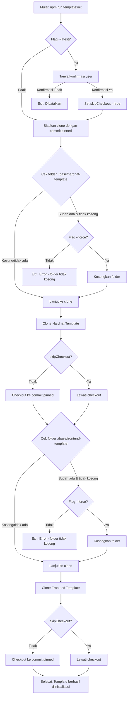

# Command: `template:init`

## Deskripsi

Command ini digunakan untuk menginisialisasi template base FHEVM Hardhat dan Frontend ke dalam folder `./base`. Template ini adalah fondasi dasar yang diperlukan untuk membuat proyek starter.

## Cara Penggunaan

### Melalui npm script:

```bash
npm run template:init
```

### Melalui CLI langsung:

```bash
ts-node scripts/cli.ts template:init [options]
```

## Parameter / Options

| Parameter      | Alias | Tipe    | Default | Deskripsi                                                                                               |
| -------------- | ----- | ------- | ------- | ------------------------------------------------------------------------------------------------------- |
| `--latest`     | -     | boolean | `false` | Menggunakan versi terbaru dari branch HEAD repositori template, melewati checkout ke commit yang di-pin |
| `--force`      | -     | boolean | `false` | Mengosongkan folder `./base` jika sudah ada isinya sebelum mengkloning template                         |
| `--cwd <path>` | -     | string  | -       | Menjalankan command seolah-olah dieksekusi dari direktori yang ditentukan                               |
| `--verbose`    | -     | boolean | `false` | Menampilkan log yang lebih detail                                                                       |
| `--json`       | -     | boolean | `false` | Mode output JSON (untuk CI/parsing log)                                                                 |

## Prasyarat

### Software yang Diperlukan:

1. **Git** - Untuk mengkloning repositori template
2. **Node.js & npm** - Untuk menjalankan script
3. **ts-node** - Untuk eksekusi TypeScript

### Kondisi Awal:

- Folder `./base` sebaiknya kosong atau tidak ada (kecuali menggunakan flag `--force`)
- Koneksi internet untuk mengkloning repositori template
- Akses ke repositori template yang dikonfigurasi di `starterkit.config.ts`

## Alur Eksekusi (Flow)



### Detail Proses:

1. **Validasi Flag `--latest`**

   - Jika menggunakan `--latest`, system akan meminta konfirmasi dari user
   - Warning: menggunakan versi latest dapat menyebabkan perbedaan hasil dan konflik saat update
   - Jika user tidak konfirmasi, proses dibatalkan

2. **Persiapan Direktori Hardhat Template**

   - Target: `./base/hardhat-template` (dari config)
   - Cek apakah direktori sudah ada dan tidak kosong
   - Jika tidak kosong dan tanpa `--force`: error dan exit
   - Jika tidak kosong dan dengan `--force`: kosongkan direktori
   - Jika tidak ada: buat direktori baru

3. **Kloning Hardhat Template**

   - Clone dari repositori yang dikonfigurasi di `starterkit.config.ts`
   - Jika tidak menggunakan `--latest`: checkout ke commit hash yang di-pin
   - Log: menampilkan progress kloning dan checkout

4. **Persiapan Direktori Frontend Template**

   - Target: `./base/frontend-template` (dari config)
   - Proses sama seperti Hardhat template
   - Cek, kosongkan jika perlu, atau buat baru

5. **Kloning Frontend Template**

   - Clone dari repositori yang dikonfigurasi di `starterkit.config.ts`
   - Jika tidak menggunakan `--latest`: checkout ke commit hash yang di-pin
   - Log: menampilkan progress kloning dan checkout

6. **Selesai**
   - Menampilkan pesan sukses
   - Exit dengan kode 0

## Konfigurasi Template

Template dikonfigurasi di file `starterkit.config.ts`:

```typescript
config.template = {
  hardhat: {
    repo: "https://github.com/...",
    dir: "./base/hardhat-template",
    commit: "abc123...", // commit hash yang di-pin
  },
  frontend: {
    repo: "https://github.com/...",
    dir: "./base/frontend-template",
    commit: "def456...", // commit hash yang di-pin
  },
};
```

## Contoh Penggunaan

### 1. Inisialisasi Normal (dengan commit pinned)

```bash
npm run template:init
```

Output:

```
✓ Cek apakah direktori target ./base/hardhat-template siap digunakan...
✓ Membuat direktori target ./base/hardhat-template...
ℹ Mengkloning template Hardhat...
ℹ Checkout template Hardhat ke commit abc123...
✓ Template Hardhat berhasil dikloning.
✓ Template Frontend berhasil dikloning.
✓ Inisialisasi template selesai.
```

### 2. Inisialisasi dengan Versi Latest

```bash
npm run template:init -- --latest
```

User akan ditanya konfirmasi:

```
? Anda memilih --latest. Menggunakan template versi latest bisa menyebabkan
  perbedaan hasil dan konflik saat update. Lanjutkan tanpa checkout ke commit pinned? (y/N)
```

### 3. Force Override Template yang Sudah Ada

```bash
npm run template:init -- --force
```

Akan mengosongkan `./base` jika sudah ada isinya.

### 4. Kombinasi Options

```bash
npm run template:init -- --latest --force --verbose
```

## Error Handling

### Error: "Direktori target tidak kosong!"

**Penyebab**: Folder `./base/hardhat-template` atau `./base/frontend-template` sudah ada dan tidak kosong

**Solusi**:

1. Hapus manual isi folder `./base`, atau
2. Gunakan flag `--force`: `npm run template:init -- --force`

### Error: Clone Gagal

**Penyebab**:

- Tidak ada koneksi internet
- URL repositori salah
- Tidak ada akses ke repositori

**Solusi**:

1. Cek koneksi internet
2. Verifikasi URL repositori di `starterkit.config.ts`
3. Pastikan memiliki akses ke repositori (public atau dengan credentials)

### Error: Git Checkout Gagal

**Penyebab**: Commit hash yang di-pin tidak ditemukan di repositori

**Solusi**:

1. Verifikasi commit hash di `starterkit.config.ts`
2. Update commit hash ke versi yang valid
3. Atau gunakan flag `--latest` untuk melewati checkout

## Best Practices

1. **Gunakan Commit Pinned**: Untuk konsistensi, gunakan commit yang di-pin (default behavior)
2. **Backup Sebelum Force**: Jika menggunakan `--force`, pastikan backup perubahan lokal
3. **Cek Versi**: Setelah init, cek versi dengan melihat commit di folder template
4. **Dokumentasi**: Catat versi commit yang digunakan untuk reproduksibilitas

## Langkah Selanjutnya

Setelah menjalankan `template:init`, langkah selanjutnya biasanya:

1. **Setup Frontend** (jika diperlukan):

   ```bash
   npm run template:build-ui
   ```

2. **List Starter yang Tersedia**:

   ```bash
   npm run starter:list
   ```

3. **Buat Proyek Starter**:
   ```bash
   npm run starter:create <nama-starter>
   ```

## File yang Terkait

- **Script**: `scripts/commands/templateInit.ts`
- **Config**: `starterkit.config.ts`
- **CLI**: `scripts/cli.ts`
- **Helper**: `lib/helper/utils.ts`

## Notes

- Command ini adalah **read & write** operation
- Command ini **TIDAK** menginstall dependencies npm
- Template yang di-clone masih perlu build/setup lebih lanjut dengan command `template:build-ui`
- Folder `.git` di dalam template akan tetap ada, memungkinkan tracking perubahan
