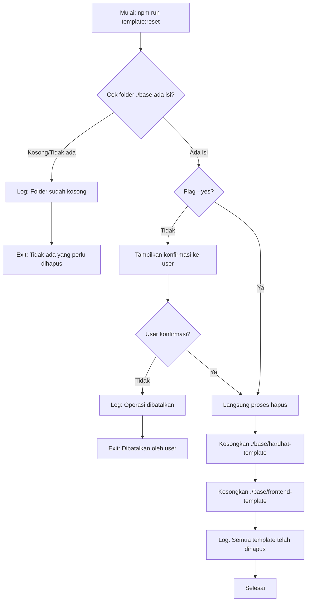

# Command: `template:reset` / `template:clean`

## Deskripsi

Command ini digunakan untuk **mengosongkan** (menghapus semua isi) template FHEVM Hardhat dan Frontend dari folder `./base`. Command ini adalah operasi **BERBAHAYA** karena menghapus data tanpa bisa di-recover.

**Alias**: Command ini memiliki alias `template:clean` yang melakukan operasi yang sama.

## Cara Penggunaan

### Melalui npm script:

```bash
npm run template:reset
# atau
npm run template:clean
```

### Melalui CLI langsung:

```bash
ts-node scripts/cli.ts template:reset [options]
# atau
ts-node scripts/cli.ts template:clean [options]
```

## Parameter / Options

| Parameter      | Alias | Tipe    | Default | Deskripsi                                                                 |
| -------------- | ----- | ------- | ------- | ------------------------------------------------------------------------- |
| `--yes`        | -     | boolean | `false` | Melewati konfirmasi dan langsung mengosongkan folder (DANGEROUS)          |
| `--cwd <path>` | -     | string  | -       | Menjalankan command seolah-olah dieksekusi dari direktori yang ditentukan |
| `--verbose`    | -     | boolean | `false` | Menampilkan log yang lebih detail                                         |
| `--json`       | -     | boolean | `false` | Mode output JSON (untuk CI/parsing log)                                   |

## Prasyarat

### Software yang Diperlukan:

1. **Node.js & npm** - Untuk menjalankan script
2. **ts-node** - Untuk eksekusi TypeScript

### Kondisi Awal:

- Folder `./base` ada dan berisi template (jika kosong, tidak ada yang akan dihapus)
- **PERHATIAN**: Semua perubahan lokal di `./base` akan hilang!

## Alur Eksekusi (Flow)



### Detail Proses:

1. **Validasi Keberadaan Template**

   - Cek apakah `./base/hardhat-template` ada dan tidak kosong
   - Cek apakah `./base/frontend-template` ada dan tidak kosong
   - Jika kedua folder kosong atau tidak ada: exit dengan pesan info

2. **Konfirmasi User** (jika tidak ada flag `--yes`)

   - Tampilkan prompt konfirmasi:
     ```
     ? Apakah Anda yakin ingin mengosongkan semua template di folder ./base?
       Tindakan ini tidak dapat dibatalkan. (y/N)
     ```
   - Default: **No** (untuk keamanan)
   - Jika user pilih "No": batalkan operasi dan exit
   - Jika user pilih "Yes": lanjutkan ke penghapusan

3. **Bypass Konfirmasi** (dengan flag `--yes`)

   - Langsung proses penghapusan tanpa konfirmasi
   - **WARNING**: Sangat berbahaya, gunakan dengan hati-hati!
   - Cocok untuk automation/CI/CD

4. **Penghapusan Template**

   - Hapus semua isi folder `./base/hardhat-template`
   - Hapus semua isi folder `./base/frontend-template`
   - Folder parent (`./base`) tetap ada (tidak dihapus)
   - Folder template (hardhat-template, frontend-template) tetap ada tapi kosong
   - Log: "Mengosongkan folder ./base..."

5. **Selesai**
   - Log: "Semua template di folder ./base telah dihapus."
   - Folder ./base sekarang kosong dan siap untuk init ulang

## Konfigurasi

Direktori yang akan dikosongkan diambil dari `starterkit.config.ts`:

```typescript
config.template = {
  hardhat: {
    dir: "./base/hardhat-template", // ← akan dikosongkan
  },
  frontend: {
    dir: "./base/frontend-template", // ← akan dikosongkan
  },
};
```

## Contoh Penggunaan

### 1. Reset dengan Konfirmasi (Recommended)

```bash
npm run template:reset
```

Output:

```
? Apakah Anda yakin ingin mengosongkan semua template di folder ./base?
  Tindakan ini tidak dapat dibatalkan. (y/N) › No
```

Jika user ketik `y`:

```
ℹ Mengosongkan folder ./base...
ℹ Semua template di folder ./base telah dihapus.
```

### 2. Reset Tanpa Konfirmasi (Dangerous!)

```bash
npm run template:reset -- --yes
```

Output:

```
ℹ Mengosongkan folder ./base...
ℹ Semua template di folder ./base telah dihapus.
```

### 3. Reset dengan Alias

```bash
npm run template:clean -- --yes
```

Sama seperti `template:reset`.

### 4. Cek Status Sebelum Reset

```bash
# Cek isi folder ./base
ls -la ./base

# Jika ingin hapus
npm run template:reset
```

## Error Handling

### Info: "Folder ./base sudah kosong"

**Penyebab**: Tidak ada isi di folder `./base/hardhat-template` dan `./base/frontend-template`

**Solusi**: Tidak perlu action. Folder sudah dalam keadaan bersih.

### Warning: "Operasi dibatalkan oleh user"

**Penyebab**: User memilih "No" pada konfirmasi

**Solusi**: Ini adalah behavior yang diharapkan. Tidak ada yang berubah.

### Error: Permission Denied

**Penyebab**:

- Tidak ada permission untuk menghapus file/folder
- File sedang digunakan oleh process lain

**Solusi**:

1. Tutup semua aplikasi yang menggunakan file di `./base`
2. Run command dengan permission yang cukup
3. Pada Windows, pastikan tidak ada file yang di-lock

## Use Cases

### 1. Clean Slate Development

```bash
# Mulai dari awal
npm run template:reset -- --yes
npm run template:init
npm run template:build-ui
```

### 2. Fix Corrupted Templates

```bash
# Template rusak, reset dan clone ulang
npm run template:reset
npm run template:init
```

### 3. Switch Template Version

```bash
# Ganti dari commit pinned ke latest
npm run template:reset
npm run template:init -- --latest
```

### 4. CI/CD Cleanup

```bash
# Clean up di CI environment
npm run template:clean -- --yes
```

## Safety Features

### 1. Konfirmasi Default

- Tanpa flag `--yes`, user harus konfirmasi
- Default answer: **No** (lebih aman)

### 2. Tidak Menghapus Folder Parent

- Folder `./base` tidak dihapus
- Hanya isi di dalamnya yang dihapus

### 3. Tidak Menghapus Konfigurasi Root

- File di root project (seperti `.env.local`) tidak terpengaruh
- Hanya folder `./base` yang terdampak

### 4. Clear Warning Message

- Pesan konfirmasi jelas: "tidak dapat dibatalkan"
- User aware akan konsekuensi

## Best Practices

### 1. Backup Sebelum Reset

```bash
# Backup folder ./base jika ada perubahan penting
cp -r ./base ./base-backup
npm run template:reset
```

### 2. Gunakan Git untuk Tracking

```bash
# Commit perubahan sebelum reset
git add ./base
git commit -m "backup: save changes before reset"
npm run template:reset
```

### 3. Hindari --yes di Development

```bash
# Development: gunakan konfirmasi
npm run template:reset

# CI/CD: boleh gunakan --yes
npm run template:reset -- --yes
```

### 4. Check Status After Reset

```bash
npm run template:reset
ls -la ./base  # pastikan kosong
npm run template:init  # setup ulang
```

## Perbedaan dengan template:update

| Command           | Action                               | Use Case                                            |
| ----------------- | ------------------------------------ | --------------------------------------------------- |
| `template:reset`  | **Hapus semua** isi ./base           | Mulai dari nol, fix corruption                      |
| `template:update` | **Update** template ke versi terbaru | Update ke commit terbaru tanpa hapus manual changes |

```bash
# Reset: hapus semua, clone ulang
npm run template:reset
npm run template:init

# vs

# Update: git pull ke commit terbaru
npm run template:update
```

## Kombinasi dengan Command Lain

### Clean & Reinit

```bash
npm run template:reset && npm run template:init
```

### Clean & Setup Fresh

```bash
npm run template:reset -- --yes && npm run start
# start = template:init + template:build-ui
```

### Clean & Init with Latest

```bash
npm run template:reset -- --yes
npm run template:init -- --latest
npm run template:build-ui
```

## Automation Example

### Script untuk Fresh Setup

Buat di `package.json`:

```json
{
  "scripts": {
    "fresh-setup": "npm run template:reset -- --yes && npm run template:init && npm run template:build-ui"
  }
}
```

Usage:

```bash
npm run fresh-setup
```

## File yang Terkait

- **Script**: `scripts/commands/templateReset.ts`
- **Config**: `starterkit.config.ts`
- **CLI**: `scripts/cli.ts`
- **Helper**: `lib/helper/utils.ts` (fungsi `emptyDir`)

## Data yang Dihapus

Setelah `template:reset`, yang akan hilang:

- Semua file di `./base/hardhat-template/`
  - contracts/
  - deploy/
  - test/
  - node_modules/
  - .git/ (git history)
  - dll
- Semua file di `./base/frontend-template/`
  - src/
  - public/
  - dist/
  - node_modules/
  - .git/ (git history)
  - .env.local
  - dll

Yang **TIDAK** dihapus:

- File di root project (seperti `.env.local`)
- Folder `./starters/`
- Folder `./workspace/` (jika ada)
- Konfigurasi project (`starterkit.config.ts`, `package.json`, dll)

## Recovery Options

### Jika Tidak Sengaja Reset:

**Tidak ada undo untuk command ini!**

Tapi ada beberapa cara recovery:

1. **Git Recovery** (jika di-commit):

   ```bash
   git checkout ./base
   ```

2. **Backup Recovery** (jika ada backup):

   ```bash
   cp -r ./base-backup ./base
   ```

3. **Reinit** (clone ulang):
   ```bash
   npm run template:init
   npm run template:build-ui
   ```

## Notes

- Command ini adalah **DESTRUCTIVE** operation
- Tidak ada "undo" atau "recycle bin"
- Gunakan dengan **sangat hati-hati** di production/development aktif
- Cocok untuk automation dan cleanup CI/CD
- Alias `template:clean` melakukan hal yang persis sama
- Tidak mempengaruhi folder `./workspace` atau `./starters`
