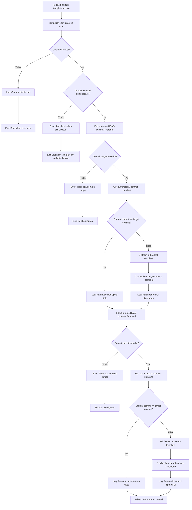

# Command: `template:update`

## Deskripsi

Command ini digunakan untuk **memperbarui** template FHEVM Hardhat dan Frontend di dalam folder `./base` ke versi terbaru dari branch utama repositori. Command ini melakukan git pull/checkout untuk update template tanpa menghapus folder (lebih gentle daripada reset).

## Cara Penggunaan

### Melalui npm script:

```bash
npm run template:update
```

### Melalui CLI langsung:

```bash
ts-node scripts/cli.ts template:update
```

## Parameter / Options

| Parameter      | Alias | Tipe    | Default | Deskripsi                                                                 |
| -------------- | ----- | ------- | ------- | ------------------------------------------------------------------------- |
| `--cwd <path>` | -     | string  | -       | Menjalankan command seolah-olah dieksekusi dari direktori yang ditentukan |
| `--verbose`    | -     | boolean | `false` | Menampilkan log yang lebih detail dari git operations                     |
| `--json`       | -     | boolean | `false` | Mode output JSON (untuk CI/parsing log)                                   |

## Prasyarat

### Software yang Diperlukan:

1. **Git** - Untuk operasi git fetch dan checkout
2. **Node.js & npm** - Untuk menjalankan script
3. **ts-node** - Untuk eksekusi TypeScript

### Kondisi Awal:

- Template **sudah diinisialisasi** di folder `./base`
  - Jalankan `npm run template:init` terlebih dahulu jika belum
- Folder `./base/hardhat-template` dan `./base/frontend-template` adalah **valid git repositories**
- **Koneksi internet** untuk fetch dari remote repository

### Warning:

⚠️ **Perubahan lokal akan hilang!** Update akan melakukan hard reset ke commit target.

## Alur Eksekusi (Flow)



### Detail Proses:

1. **Konfirmasi User**

   - Tampilkan peringatan:
     ```
     ? Apakah Anda yakin ingin memperbarui template ke versi terbaru dari repositori resmi?
       (perubahan lokal akan hilang) (y/N)
     ```
   - Default: **No** (untuk keamanan)
   - Jika user pilih "No": batalkan operasi dan exit
   - Jika user pilih "Yes": lanjutkan update

2. **Validasi Template Initialized**

   - Cek apakah folder `./base/hardhat-template` ada
   - Cek apakah folder `./base/frontend-template` ada
   - Jika salah satu tidak ada: error dan minta user jalankan `template:init`

3. **Update Hardhat Template**

   a. **Fetch Remote HEAD Commit**:

   - Jalankan `git ls-remote` untuk mendapat commit hash terbaru dari branch main
   - Ini mengambil info dari remote tanpa mengubah local repository

   b. **Get Current Local Commit**:

   - Jalankan `git rev-parse HEAD` di `./base/hardhat-template`
   - Mendapat commit hash yang sedang active di local

   c. **Compare Commits**:

   - Jika current == target: log "sudah up-to-date", skip update
   - Jika berbeda: lanjutkan ke checkout

   d. **Git Checkout**:

   - Jalankan `git fetch origin` (download objects dari remote)
   - Jalankan `git checkout <target-commit>` (switch ke commit target)
   - Log: "Template Hardhat berhasil diperbarui"

4. **Update Frontend Template**

   - Proses yang sama seperti Hardhat template
   - Fetch remote HEAD → Compare → Checkout jika berbeda

5. **Selesai**
   - Log: "Pembaruan template selesai."
   - Kedua template sekarang di versi terbaru

## Konfigurasi

Konfigurasi repositori diambil dari `starterkit.config.ts`:

```typescript
config.template = {
  hardhat: {
    repo: "https://github.com/zama-ai/fhevm-hardhat-template",
    dir: "./base/hardhat-template",
    commit: "abc123...", // commit pinned (untuk fallback)
  },
  frontend: {
    repo: "https://github.com/zama-ai/fhevm-react-template",
    dir: "./base/frontend-template",
    commit: "def456...", // commit pinned (untuk fallback)
  },
};
```

## Contoh Penggunaan

### 1. Update Normal (Recommended)

```bash
npm run template:update
```

Output:

```
? Apakah Anda yakin ingin memperbarui template ke versi terbaru dari repositori resmi?
  (perubahan lokal akan hilang) (y/N) › Yes

▶ template:update
ℹ Memeriksa apakah template sudah diinisialisasi...
ℹ Template sudah diinisialisasi.
ℹ Memperbarui template Hardhat...
ℹ Checkout template Hardhat ke commit abc123def...
✓ Template Hardhat berhasil diperbarui.
ℹ Memperbarui template Frontend...
ℹ Checkout template Frontend ke commit def456ghi...
✓ Template Frontend berhasil diperbarui.
✓ Pembaruan template selesai.
```

### 2. Update dengan Verbose

```bash
npm run template:update -- --verbose
```

Akan menampilkan detail git operations:

```
ℹ [debug] template:update {"verbose":true}
▶ template:update
...
[git fetch output]
[git checkout output]
...
```

### 3. Template Sudah Up-to-Date

```bash
npm run template:update
```

Output:

```
ℹ Memperbarui template Hardhat...
ℹ Template Hardhat sudah di commit target. Tidak ada yang perlu diperbarui.
ℹ Memperbarui template Frontend...
ℹ Template Frontend sudah di commit target. Tidak ada yang perlu diperbarui.
✓ Pembaruan template selesai.
```

### 4. Batalkan Update

```bash
npm run template:update
```

```
? Apakah Anda yakin ingin memperbarui template ke versi terbaru dari repositori resmi?
  (perubahan lokal akan hilang) (y/N) › No

⚠ Operasi pembaruan dibatalkan oleh user.
```

## Error Handling

### Error: "Template belum diinisialisasi!"

**Penyebab**: Folder `./base/hardhat-template` atau `./base/frontend-template` tidak ada

**Solusi**:

```bash
# Inisialisasi terlebih dahulu
npm run template:init
npm run template:build-ui

# Lalu update
npm run template:update
```

### Error: "Tidak ada commit target"

**Penyebab**:

- Gagal fetch remote HEAD commit
- Tidak ada koneksi internet
- URL repositori salah
- Repositori tidak ada branch main

**Solusi**:

1. Cek koneksi internet
2. Verifikasi URL repositori di `starterkit.config.ts`
3. Pastikan branch "main" exists di remote
4. Coba manual:
   ```bash
   cd ./base/hardhat-template
   git remote -v
   git ls-remote origin HEAD
   ```

### Error: Git Checkout Gagal

**Penyebab**:

- Local changes yang conflict
- Git repository corrupt
- Commit hash tidak valid

**Solusi**:

1. **Hard reset** (akan hilangkan semua perubahan lokal):

   ```bash
   cd ./base/hardhat-template
   git fetch origin
   git reset --hard origin/main
   ```

2. **Atau clean & reinit**:
   ```bash
   npm run template:reset -- --yes
   npm run template:init
   ```

### Warning: "commit saat ini berbeda dari commit pinned"

**Penyebab**: Local commit tidak sesuai dengan pinned commit di config, tapi juga gagal fetch remote

**Solusi**:

1. Cek commit pinned di `starterkit.config.ts`
2. Update commit hash jika outdated
3. Atau reset dan init ulang

## Perbedaan dengan Command Lain

### vs `template:init`

| Aspect          | `template:init`               | `template:update`                 |
| --------------- | ----------------------------- | --------------------------------- |
| **Action**      | Clone dari scratch            | Update existing repository        |
| **Prasyarat**   | Folder ./base kosong          | Folder ./base sudah ada template  |
| **Speed**       | Lebih lambat (download semua) | Lebih cepat (hanya fetch changes) |
| **Git History** | Clone full history            | Fetch dan checkout                |
| **Use Case**    | Setup awal                    | Update rutin                      |

### vs `template:reset`

| Aspect            | `template:reset`    | `template:update`                    |
| ----------------- | ------------------- | ------------------------------------ |
| **Destructive**   | Ya (hapus semua)    | Semi (overwrite dengan git checkout) |
| **Git Repo**      | Dihapus             | Tetap ada                            |
| **Local Changes** | Dihapus             | Dihapus (dengan warning)             |
| **Follow-up**     | Butuh template:init | Langsung ready                       |

## Workflow Comparison

### Scenario 1: Update Template

```bash
# Option A: Update (faster)
npm run template:update

# Option B: Reset & Init (slower, but cleaner)
npm run template:reset -- --yes
npm run template:init
```

### Scenario 2: Switch Versions

```bash
# Dari pinned commit ke latest
npm run template:reset -- --yes
npm run template:init -- --latest

# atau
npm run template:update  # akan ke latest HEAD
```

### Scenario 3: Fix Corrupt Template

```bash
# Update mungkin tidak cukup, lebih baik reset
npm run template:reset -- --yes
npm run template:init
```

## Git Operations Detail

### Fetch Remote HEAD

```bash
git ls-remote <repo-url> HEAD
# Output: abc123def456...  HEAD
```

### Get Local Commit

```bash
cd ./base/hardhat-template
git rev-parse HEAD
# Output: abc123def456...
```

### Checkout Commit

```bash
cd ./base/hardhat-template
git fetch origin
git checkout abc123def456...
# Detached HEAD state di commit target
```

## Best Practices

### 1. Backup Perubahan Penting

```bash
# Sebelum update, backup jika ada custom changes
cp -r ./base/hardhat-template ./base/hardhat-template-backup
npm run template:update
```

### 2. Commit Custom Changes ke Git

```bash
cd ./base/hardhat-template
git add .
git commit -m "custom: my changes before update"
git branch my-custom-changes  # create branch untuk backup

# Lalu update
cd ../..
npm run template:update
```

### 3. Update Setelah Starter Creation

```bash
# Jangan update template setelah buat starter, bisa inconsistent
# Workflow yang benar:

npm run template:update  # update dulu
npm run starter:create fhe-counter  # baru create
```

### 4. Periodic Updates

```bash
# Update template secara berkala untuk bug fixes & improvements
# Misalnya, setiap minggu atau sebulan sekali

npm run template:update
npm run template:build-ui  # rebuild frontend jika ada changes
```

### 5. Check Changes After Update

```bash
npm run template:update

# Cek perubahan
cd ./base/hardhat-template
git log -1  # lihat commit terbaru
git diff HEAD~1  # lihat changes dari commit sebelumnya
```

## Advanced Usage

### Update Specific Template Only

Script tidak support ini secara native, tapi bisa manual:

```bash
# Update Hardhat only
cd ./base/hardhat-template
git fetch origin
git checkout origin/main

# Update Frontend only
cd ../frontend-template
git fetch origin
git checkout origin/main
```

### Update to Specific Commit

```bash
# Manual checkout ke commit tertentu
cd ./base/hardhat-template
git fetch origin
git checkout <specific-commit-hash>
```

### Compare Before Update

```bash
cd ./base/hardhat-template
git fetch origin
git log HEAD..origin/main  # lihat commits yang akan di-update
git diff HEAD..origin/main  # lihat changes detail
```

## Rebuild After Update

Setelah update template, mungkin perlu rebuild:

```bash
npm run template:update

# Jika frontend berubah, rebuild
npm run template:build-ui

# Atau all-in-one
npm run template:update && npm run template:build-ui
```

## CI/CD Integration

### GitHub Actions Example

```yaml
name: Update Templates

on:
  schedule:
    - cron: "0 0 * * 0" # Every Sunday
  workflow_dispatch: # Manual trigger

jobs:
  update:
    runs-on: ubuntu-latest
    steps:
      - uses: actions/checkout@v2

      - name: Setup Node.js
        uses: actions/setup-node@v2
        with:
          node-version: "18"

      - name: Install dependencies
        run: npm install

      - name: Update templates
        run: npm run template:update
        # Note: Akan gagal karena butuh konfirmasi interaktif
        # Perlu modifikasi script untuk support --yes flag
```

## File yang Terkait

- **Script**: `scripts/commands/templateUpdate.ts`
- **Config**: `starterkit.config.ts`
- **CLI**: `scripts/cli.ts`
- **Helper**:
  - `lib/helper/utils.ts` (getRemoteHeadCommitHash, checkoutRepoCommit)

## Recovery dari Failed Update

### Jika Update Gagal di Tengah Jalan:

1. **Manual Fix**:

   ```bash
   cd ./base/hardhat-template
   git status  # cek status
   git fetch origin
   git reset --hard origin/main
   ```

2. **Nuclear Option** (reset semua):

   ```bash
   npm run template:reset -- --yes
   npm run template:init
   ```

3. **Restore dari Backup**:
   ```bash
   rm -rf ./base/hardhat-template
   cp -r ./base/hardhat-template-backup ./base/hardhat-template
   ```

## Notes

- Command ini melakukan **git operations** di local repository
- **Perubahan lokal akan hilang** tanpa bisa di-recover (kecuali ada backup/git branch)
- Update ke **latest commit dari branch main** di remote
- Lebih **efisien** daripada reset+init karena menggunakan git fetch
- **Detached HEAD state** setelah update (normal untuk pinned commit)
- Tidak mempengaruhi `node_modules` atau build output (`dist`)
- Setelah update, mungkin perlu `npm install` jika dependencies berubah
